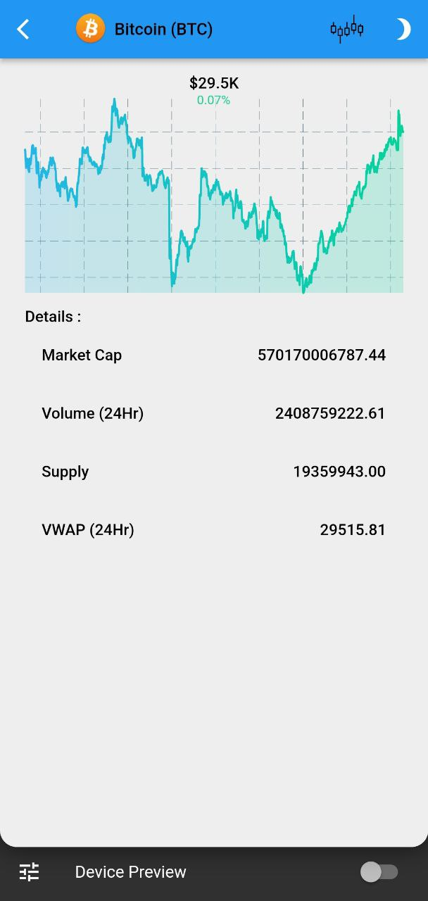
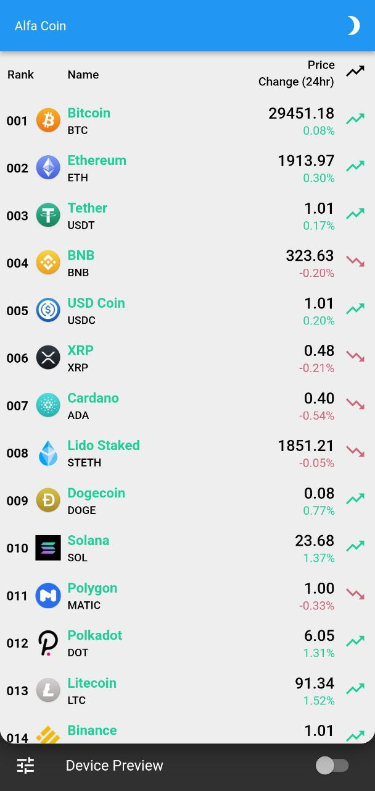
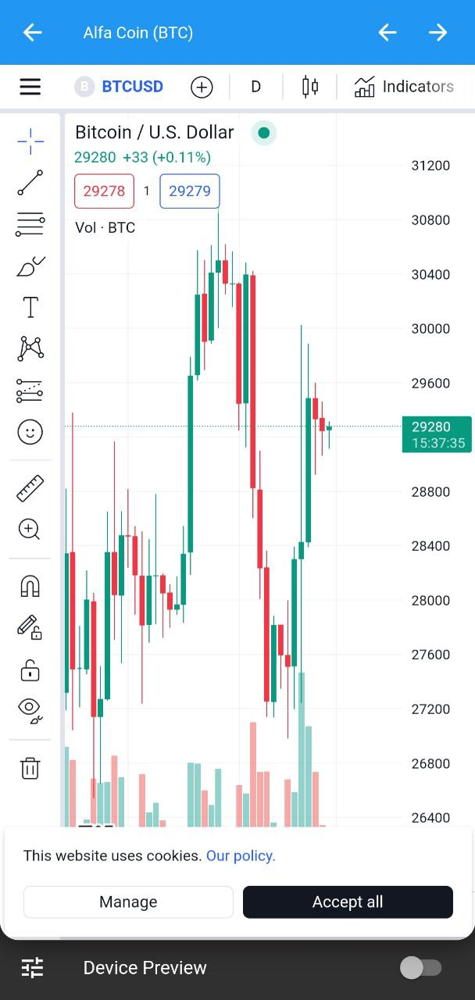

# alfa_coin

A program to display the status of digital currencies with flutter

## screenshots

### android application ( mobile[android,ios] )

<p float="left">
  
   
  
</p>

### linux applicationv ( desktop[linux,mac,windows]) 

<p float="left">
  
   
</p>

## Developers
Please subscribe into our [Telegram channel](https://t.me/alirezabashi_98) and to conntact with the developer click this [link address.](https://t.me/alirezabashi98)

for flutter developers:
### Getting Started
```shel
https://github.com/alirezabashi98/AlfaCoin.git
cd alfa_coin
flutter pub get
flutter create . --platforms=android
flutter run 
```

For the rest of the operating systems, you can also use the following command, for example, for Linux as below, if there are several, put a comma between them as below

```shel
flutter create . --platforms=linux,android
```

this repo will be updated :blue_heart: .


## Links

* [Youtube channel](https://www.youtube.com/@alirezabashi98)
* [Instagram](https://instagram.com/alirezabashi98)
